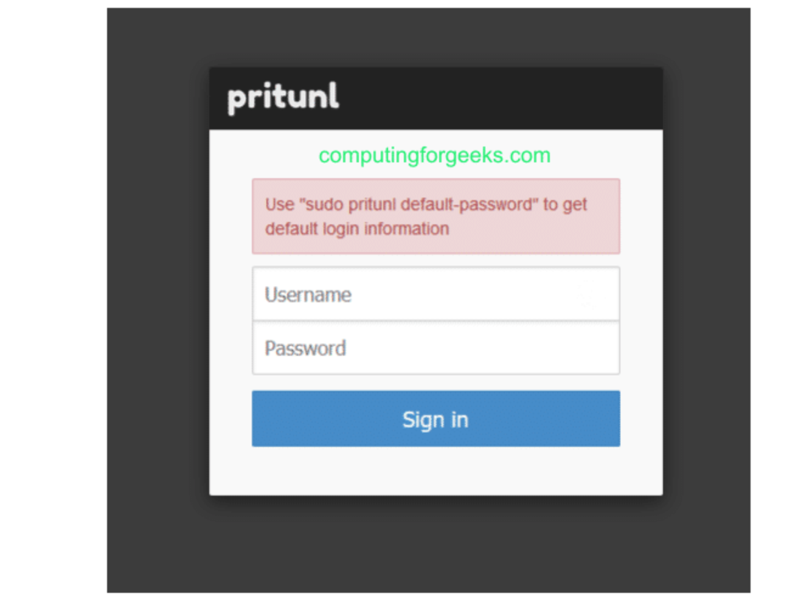
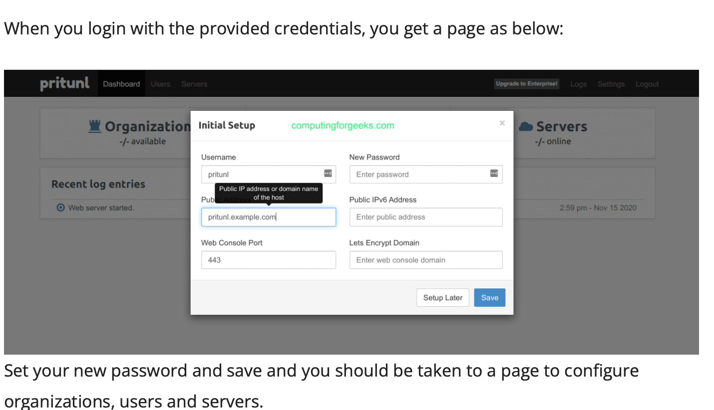
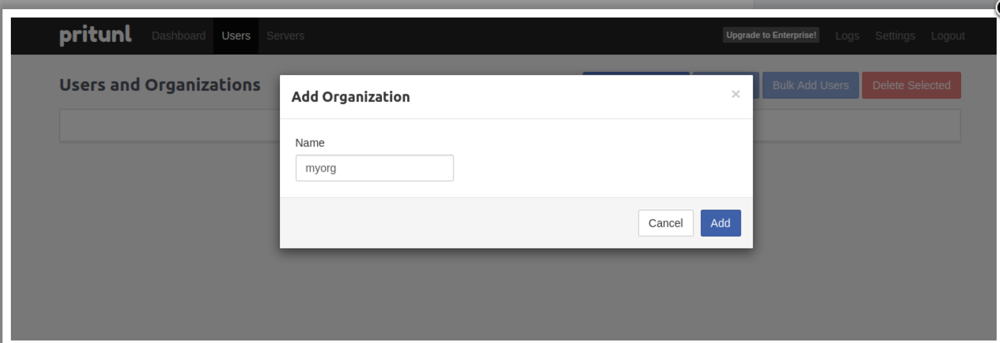
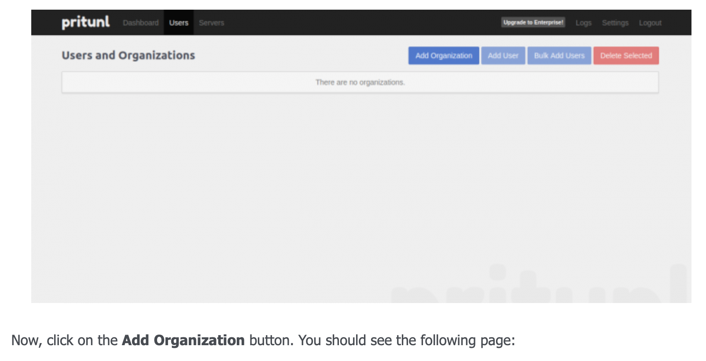
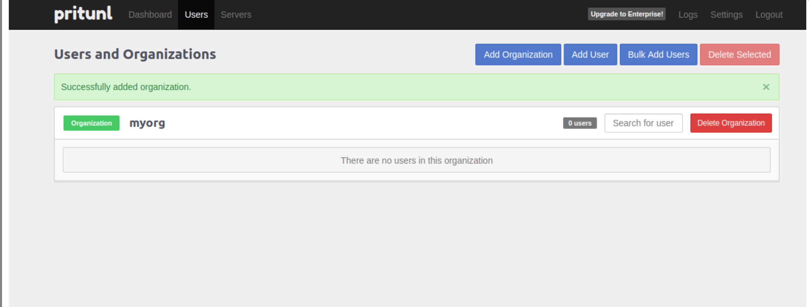
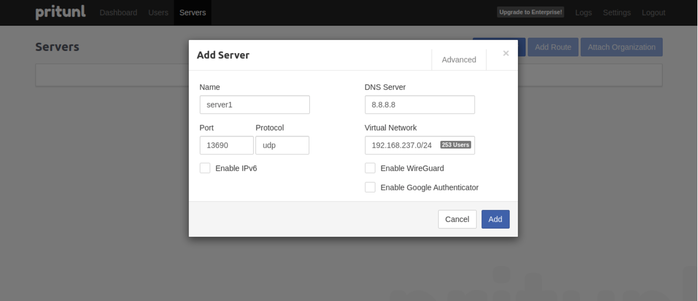
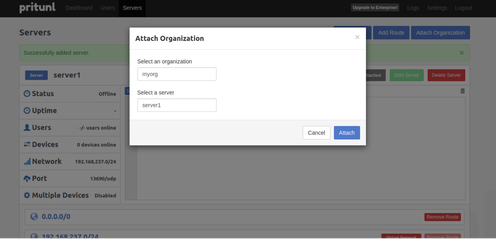

# Terraform-pritunl-vpn-setup
Setup Pritunl VPN using AWS, GCP or Azure.

# After provisioning Access the Pritunl interface by using the public IP of your server.

# Login running the login to the server and run the following command: 
 # To Generate setup-key by running the command below:
 sudo pritunl setup-key

 

#  To generate the pritunl default password:
pritunl default-password

# After enter the details in the screen above.

 # change default username and password(recommended) and also add the url to be used when access the pritunl (ensure the server IP is already added to the hosting company you are using) pritunl using letsencrypt to generate the certificate for you.

# Add an organisation using name of your oragnisation(recommended)

# create a user

# Add a server

# Attach a server to the organistion

# start the server

